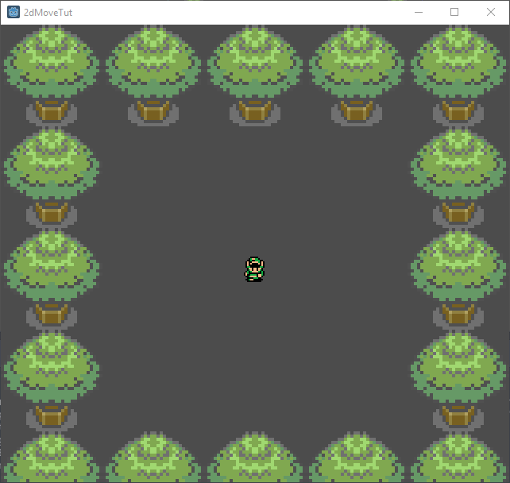

# Godot C# 2D Zelda-like Movement Example

This is bite-sized example of how to implement Zelda-like 2D movement in Godot with C#. 

For this to work, make sure you're using the Mono-version of Godot. 

[Here's a tutorial]() on how to install and configure Godot with C# support on Windows.

# Building

Clone the repository, and then open Godot. The C# solution should be recognized immediately. 

Build the project. 

Enjoy.

# Playing

Use the WASD keys (or arrow keys) to move around.

You can collide with the tree trunks, but not the tree leaves. 